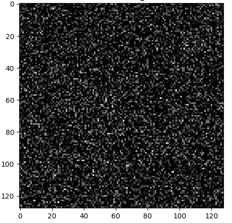
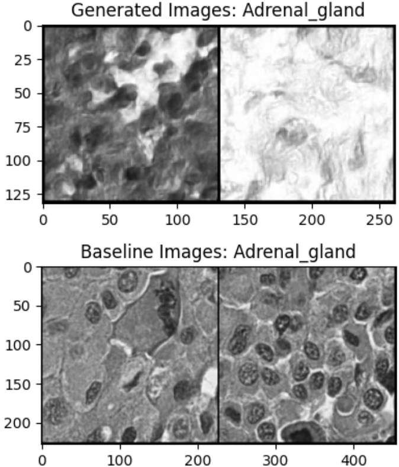
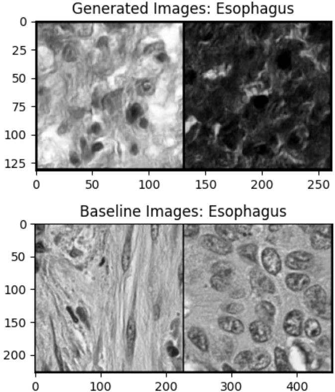
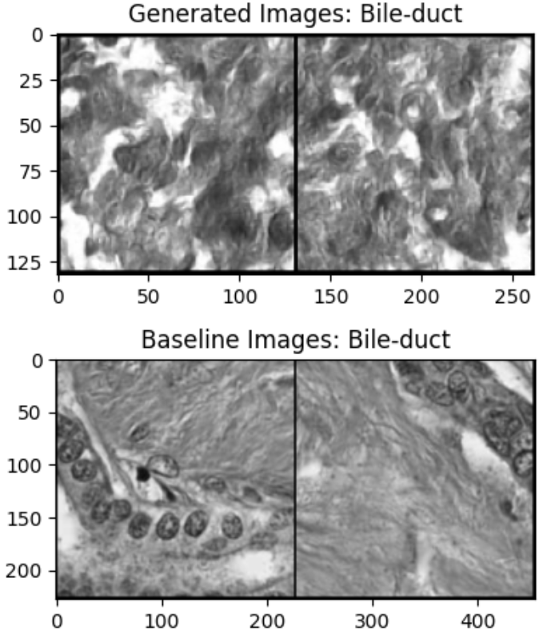
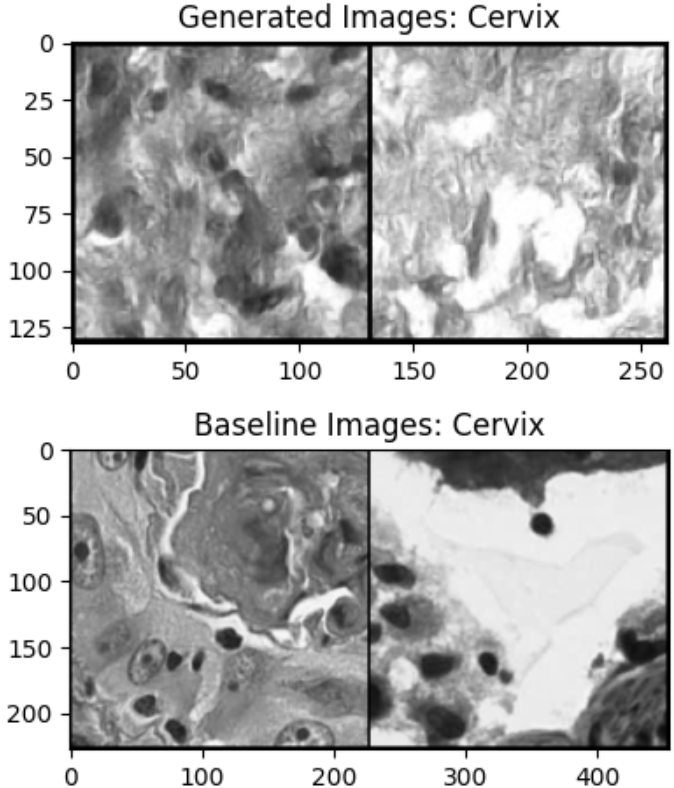
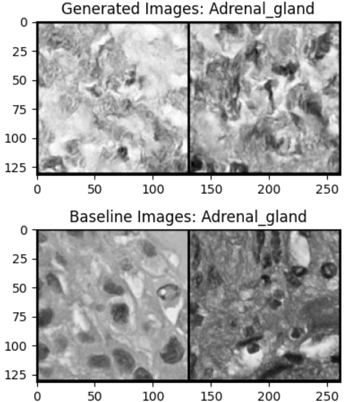
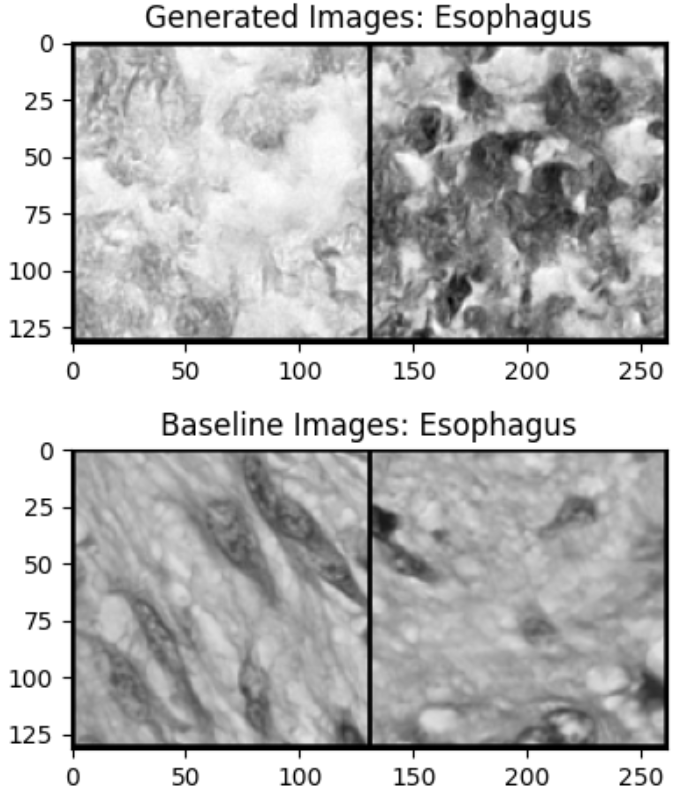
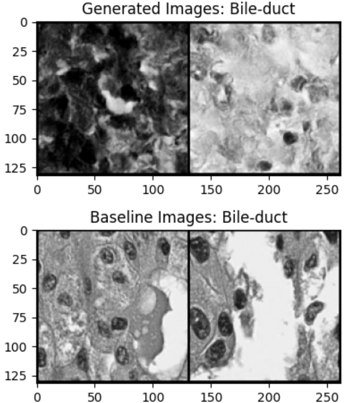
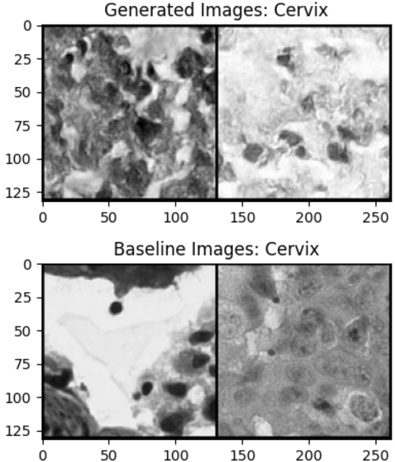

# Retrieval Augmented Diffusion for Biological Tissue Image Synthesis



This repo contains code for the synthesis of cancer tissues across 19 classes using <ins>retrieval augmented diffusion</ins>. This work is inspired by "_Semi-Parametric Neural Image Synthesis_", by Blattman et al. 2022 ([here](https://arxiv.org/abs/2204.11824)). It also contains code for class-conditioned image synthesis.

## Getting started
Please see `requirements.txt` for the full list of requirements for running the repo. This repo depends on Pytorch and HuggingFace ([Diffusers](https://huggingface.co/docs/diffusers/en/index)) libraries. Use `pip install -r requirements.txt` to install.

### Dataset
The dataset used is the PanNuke dataset from "_PanNuke Dataset Extension, Insights and Baselines_" by Gamper et al. 2020 ([here](https://arxiv.org/abs/2003.10778)). The dataset can be downloaded from ([Kaggle](https://www.kaggle.com/datasets/andrewmvd/cancer-inst-segmentation-and-classification)). Once downloaded, the config file can be updated with the `root` directory corresponding to the `images.npy` and `types.npy` files.

### Running the code
To run the code for retrieval augmented diffusion, use the following command:
```
python train_with_rag.py \
    --config config.yml \
    --gen-class 7 \
    --num-img-gens 5 \
    --do-train \
    --use-rag
```
This needs a retriever model. By default, an ImageNet pretrained ViT model is used (`google/vit-base-patch16-224-in21k` from HF), although performance can be improved by using a more specialized retriever. The retriever computes embeddings for a randomly sampled subset of images from each class in the dataset, which is then compiled and saved (as `cfg["retriever"]["embedding_dir"]`). During training, the saved retriever embeddings corresponding to the training class labels are randomly sampled and used to condition the model. For more details on training your own retriever model, see the section "Training the Retriever".

To run the class-conditioned diffusion model without any RAG, run the following command:
```
python train_with_rag.py \
    --config config.yml \
    --gen-class 7 \
    --num-img-gens 5 \
    --do-train
```
This will perform class-conditioned training of a UNet model, without using RAG. Generation is conditioned on the class label in this case.

### Other arguments
The code will generate a set of sample images at the end, and the argument `--gen-class` specifies the class of images to generate. The argument `--num-img-gens` specifies the number of images to generate for the specified class. The generation will sample some baseline images from the dataset and display it alongside the synthesized images (see examples below). The `--keep_classes` argument in the config determines which subset of classes from the dataset to use. By default, only 4 classes are used: Esophagus, Cervix, Bile-Duct, and Adrenal-Gland.

### Training the retriever
To train retriever, use the following command:
```
python train_retriever.py --config config.yml
``` 
Once trained, the saved checkpoint can be loaded for RAG diffusion by specifying the `cfg["retriever"]["wt_ckpt"]` as the saved checkpoint `.pt` file. By default, this is set to `None` in the yaml.

## Results
Further modifications to the model are pending to improve image generations. Limited training data is a particular challenge. More to come soon!

### Diffusion without RAG

<p float="left">
    
    
    
        
</p>

### Diffusion with RAG
Slight improvement in the darker cell spots that are generated.
<p float="left">
    
    
    
        
</p>

### Citation
If you find this repo helpful, please consider citing / starring the repo. Thank you!
