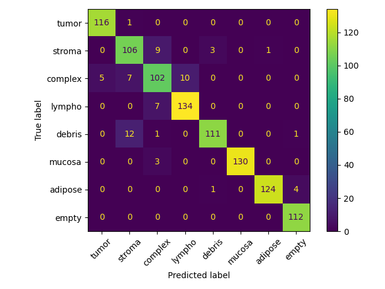
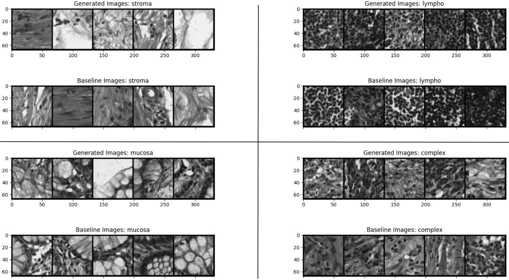
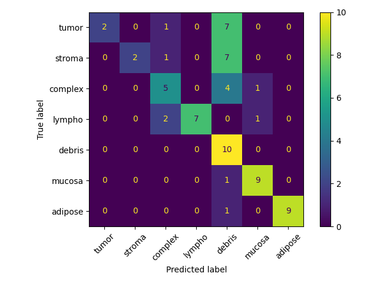

# Synthetic Generation of Colorectal Histopathological Images

This subfolder fine-tunes a tiny stable diffusion model [here](https://huggingface.co/segmind/tiny-sd) to synthetically generate images from the Kather 2016 dataset [paper](https://pubmed.ncbi.nlm.nih.gov/27306927/). The generated images are evaluated with an "expert" model (ResNet50) fine-tuned to perform classification on the dataset.

## Fine-tuning the expert model
To train the expert model, run the following:
```
python main.py \
    --config config.yml
```
The config file contains different specifications for training the expert such as batch size, image size, learning rate, epochs etc. The script also runs evaluation and plots the confusion matrix. Training with the default parameters will fine-tune ResNet50 pretrained on Imagenet-1k, and should yield ~93% accuracy.



## Fine-tuning tiny stable diffusion
To train the stable diffusion model, run the following:
```
python train_sd.py \
    --config config.yml \
    --gen-class 6 \
    --num-img-gens 5 \
    --do-train
```
This will train the model and generate 5 sample images from class 6. Sample generations can be viewed in the folder `assets/diffusion_viz`.



## Evaluating image generations
The generated images can be evaluated with the expert model using the following:
```
python evaluator.py \
    --batch-size 2 \
    --img-size 224 \
    --expert-model-ckpt r50_grayscale.pt \
    --generations-path pretrained_diff_mean_filter
```
The `--generations-path` argument should correspond to the folder containing the generated images separated into subfolders for each class. This gives 63% accuracy in generations with the following confusion matrix:

